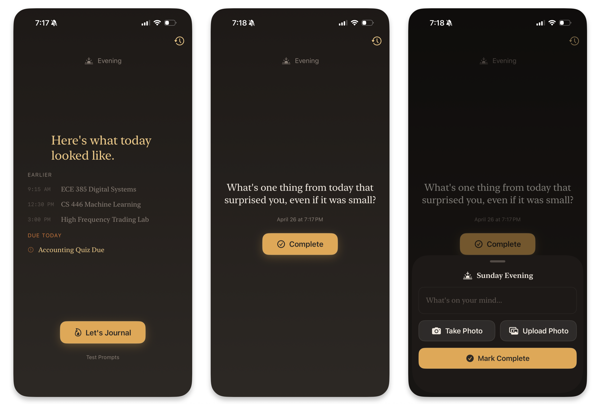

# Flint

*The best app for journaling on paper*

### What is Flint?

I love writing with a pen and paper in my journals. At any given time ,I have two active notebooks for different purposes. But oftentimes I get jealous of the features that digital journaling softwares introduce. 

Flint brings those features to my analog notebooks, giving me the absolute best of both worlds. It reads my Reminders and Calendars databases locally on my phone, then sends that data to a super tiny LLM which generates me a personalized prompt. The prompt is based on the time of the day and what I have planned/accomplished. 

If I'm at my desk, I can write in my paper journal and upload a photo to the app. Otherwise, I can write some notes directly in Flint. I'm also able to upload photos from my day, and view all of my journal history.

### What I Learned

Designing a mobile application is so different from writing code for web, OS, or other scripts/programs. There is much more to consider on the user interface side. Buttons need to be larger and further apart for your fingers, the keyboard actually takes up real estate on the screen, and you have access to a very different set of functionalities. While some of the user experience changes introduce another level of complexity to a problem, the amount of data and peripherals accessible on a mobile device make some tasks much easier. For example, I could never make a web app where users take a photo of their journal. And I couldn't directly access their local calendar or reminders either. 

I definitely want to continue working on Flint as a mobile project, and continue to create more mobile apps in the future. Distributions seems like it would be much easier, and I see so much potential for a tool when it's already in your pocket anyways.

### Future Additiona

I have so many ideas for future additions to this application. Usually when I work I set a timer for 50 minutes with a concrete goal. Then afterwards, I write about what I accomplished, where I left off, and where to pick up next time. I think this would be a perfect place to log that info. 

It would also be a nice tool for my weekly review, since I like to use some time on Sunday to look back on the previous week. Since all of the data is in one spot already, I can pretty easily design a view that synthesizes my entries and helps me reflect back. 

### Screenshots

